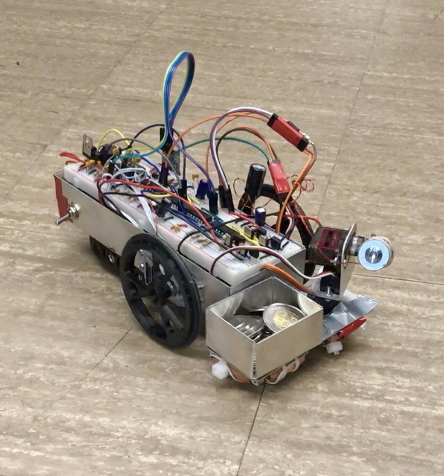

# Coin-Collecting-Robot

Fully autonomous coin collecting robot which stays in the confinement of a perimeter wire carrying AC and detects coins using a tank circuit metal detector. Motor control circuits allow a PWM signal to control robot movement, and servo motors control a robotic arm with an electromagnet to collect metallic coins. The robot also has a manual mode in which a person can send commands to the robot over Bluetooth.

Other firmware contributors: Yousof Al Autman (motor control functions and buzzer)

    
   

